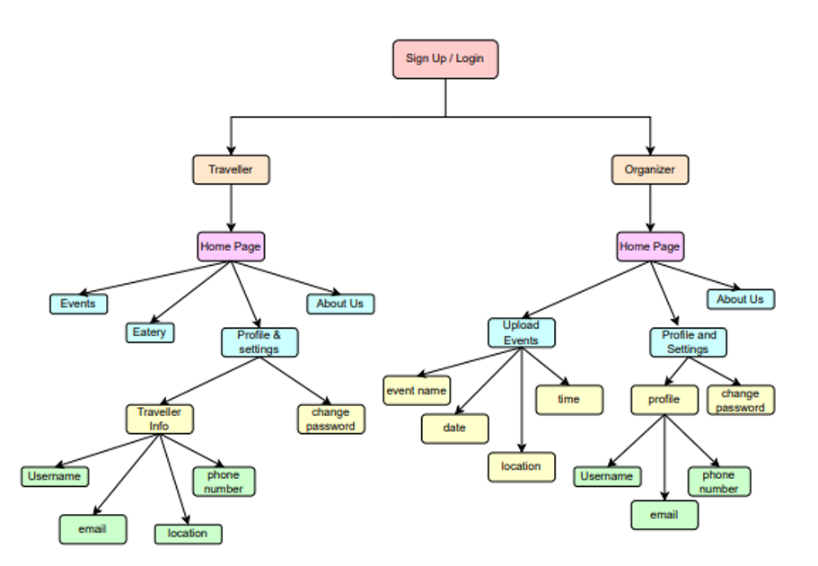
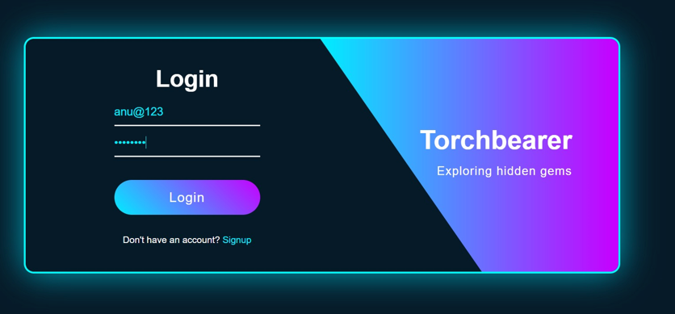
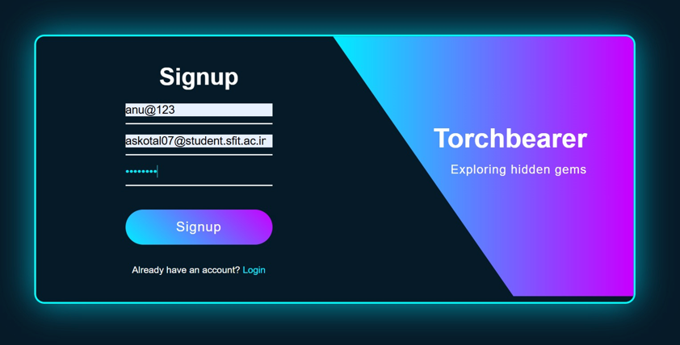
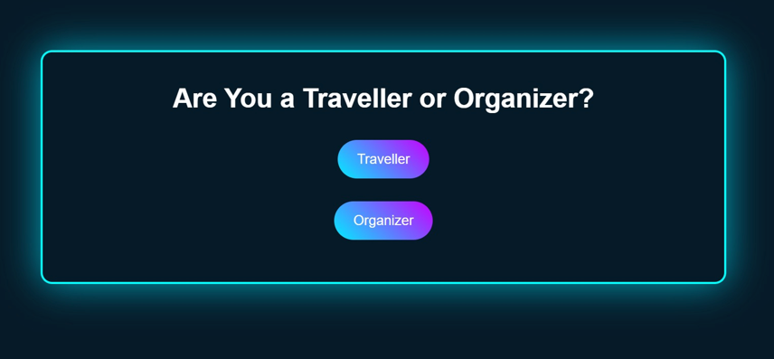

# 🔥 TorchBearer

> **A Java-based Event Discovery and Management Platform connecting event organizers and travellers through a single web application.**


---

# 📖 About

TorchBearer is a **Java-based Event Discovery and Management System** developed as a mini-project for the Department of Information Technology.

The platform aims to bridge the gap between **event organizers** and **travellers** by providing a centralized platform where organizers can publish events while travellers can easily discover, explore, and book them.

The application follows a **role-based architecture**, providing separate functionalities for Organizers and Travellers to ensure a seamless and personalized user experience.

---

# ✨ Features

## 👤 Traveller

- User Registration & Login
- Browse Upcoming Events
- Search Events
- View Event Details
- Book Events
- Cancel Bookings
- Like Events
- Comment on Events
- Explore Nearby Eateries
- Reserve Restaurant Tables
- Profile Management
- Change Password
- Feedback System

---

## 🎉 Organizer

- Secure Login
- Upload New Events
- Add Event Images
- Add Event Details
- Manage Events
- Update Profile
- Change Password
- Feedback System
- About Us Section

---

# 🚀 Tech Stack

## Frontend

- JSP (Java Server Pages)
- HTML5
- CSS3
- JavaScript

## Backend

- Java Servlets
- JDBC
- Java Beans
- DAO Architecture

## Database

- MySQL

## Server

- Apache Tomcat 10

## IDE

- Apache NetBeans

---

# 🏗️ System Architecture

The following diagram illustrates the workflow of the TorchBearer platform.

<p align="center">
    
</p>

### Workflow

```
User
   │
   ▼
Login / Signup
   │
   ├──────────────┐
   ▼              ▼
Traveller     Organizer
   │              │
Browse Events  Upload Events
Book Events    Manage Events
Eateries       Profile Settings
Feedback       About Us
```

---

# 📸 Application Screenshots

## 🔐 Login Page

<p align="center">

</p>

The Login page authenticates registered users and allows them to securely access the platform.

---

## 📝 Sign Up Page

<p align="center">

</p>

New users can register by entering their username, email address, and password before accessing the platform.

---

## 👥 Role Selection

<p align="center">

</p>

After logging in, users can continue either as a **Traveller** or an **Organizer**, giving access to role-specific functionalities.

---

# 📌 Core Functionalities

✅ Secure User Authentication

✅ Role-Based Access Control

✅ Event Creation & Management

✅ Event Discovery

✅ Event Booking

✅ Nearby Eateries

✅ Restaurant Reservation

✅ Event Likes & Comments

✅ Profile Management

✅ Feedback Collection

---

# 📂 Project Structure

```text
TorchBearer/
│
├── src/
│   ├── Bean/
│   ├── Dao/
│   ├── Servlet/
│
├── WebContent/
│   ├── css/
│   ├── js/
│   ├── images/
│   ├── *.jsp
│
├── assets/
│   ├── architecture.png
│   ├── login.png
│   ├── signup.png
│   └── role-selection.png
│
├── database/
│   └── torchbearer.sql
│
├── README.md
│
└── web.xml
```

---

# ⚙️ Installation

## 1️⃣ Clone the Repository

```bash
git clone https://github.com/yourusername/TorchBearer.git
```

---

## 2️⃣ Open the Project

Import the project into:

- Apache NetBeans
- Eclipse IDE

---

## 3️⃣ Create the Database

```sql
CREATE DATABASE torchbearer;
```

Import the SQL file:

```
database/torchbearer.sql
```

---

## 4️⃣ Configure Database Credentials

Update the database credentials inside:

```
DatabaseConnection.java
```

```java
private static final String URL = "jdbc:mysql://localhost:3306/torchbearer";
private static final String USER = "root";
private static final String PASSWORD = "your_password";
```

---

## 5️⃣ Configure Apache Tomcat

- Install Apache Tomcat 10+
- Add Tomcat Server in NetBeans
- Deploy the project

---

## 6️⃣ Run the Project

```
http://localhost:8080/TorchBearer/
```

---

# 🔒 Security

- Secure Login Authentication
- JDBC Prepared Statements
- Session Management
- Role-Based Access Control

---

# 🎯 Future Enhancements

- 💳 Payment Gateway Integration
- 🤖 AI-Based Event Recommendation System
- 📍 Google Maps Integration
- 🔔 Email & SMS Notifications
- 📱 Android/iOS Mobile Application
- 🌐 Social Media Integration
- ⭐ Event Rating & Reviews
- 📊 Analytics Dashboard
- 🎟 QR Code Based Event Check-In

---

# 👨‍💻 Team

| Name | Role |
|------|------|
| **Anushka Kotal** | Full Stack Developer |
| **Bhoomi Koli** | Full Stack Developer |
| **Jibi Johny** | Full Stack Developer |
| **Shravani Lad** | Full Stack Developer |

---


# 🙏 Acknowledgements

We sincerely thank our project guide, faculty members, and the Department of Information Technology, St. Francis Institute of Technology, for their continuous guidance and support throughout the development of this project.

---

## ⭐ If you found this project useful, consider giving it a star!
